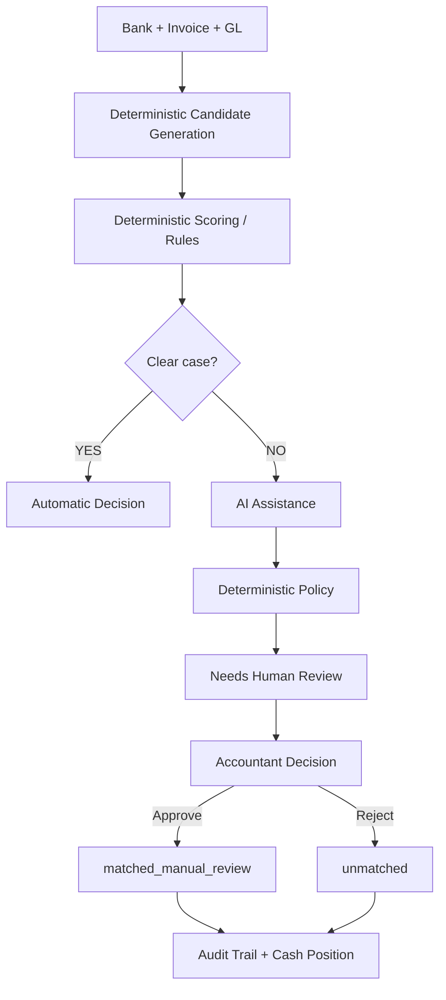

# ReconPilot

**AI-assisted Finance Controller for Indian SMBs**

## Problem
Indian SMB reconciliation is extremely complex, requiring accountants to compare bank transactions, invoices, and general ledger (GL) records. Determining which transactions perfectly match, which have slight timing/amount deviations (TDS/bank fees), and which are ambiguous requires significant manual labor and intuition.

## Solution
ReconPilot is an AI-assisted finance controller that automates clear cases using deterministic rules and assists accountants on ambiguous cases using Gemini AI. 

## Why the Hybrid Architecture Matters
Fully deterministic systems fail at ambiguous cases, leading to low match rates. Fully AI-driven systems are too unpredictable and risky for financial systems. ReconPilot combines the reliability of a deterministic matching engine with the reasoning capabilities of generative AI, providing a safe and effective middle ground.

## Core Principle: AI is Advisory, Not Authoritative
**AI can recommend, but it cannot create a financial match.**

Gemini can recommend a candidate and provide evidence, but it cannot directly create statuses like `matched_exact`, `matched_timing`, or `matched_fuzzy`. AI-assisted recommendations remain firmly in a `needs_human_review` state until an accountant explicitly approves them.

## Feature Showcase
* **Dashboard Overview:** Real-time visibility into operational metrics and cash position.
  <br>
* **Reconciliation Engine:** Seamlessly process Bank, Invoice, and GL CSVs with deterministic accuracy.
  <br>
* **Exception Management & AI Advisory:** Gemini AI evaluates ambiguous matches and provides clear, justifiable recommendations.
  <br>
* **Audit Trail:** Immutable logging of all accountant decisions ensuring full compliance and accountability.
  <br>

## Architecture



## Technology Stack
* **Backend**: FastAPI, SQLAlchemy, SQLite (Python 3.14)
* **Frontend**: Next.js 16 (React, Tailwind CSS)
* **AI Provider**: Google Gemini (`google-genai`), with Mock fallback
* **Testing**: Pytest

## Repository Structure
* `backend/` - FastAPI application, database models, AI provider, and reconciliation logic.
* `backend/data/` - Synthetic CSV datasets and SQLite database.
* `frontend/` - Next.js React dashboard for the accountant interface.

## Quick Start

1. **Clone the repository:**
   ```bash
   git clone <repository-url>
   cd ReconPilot
   ```

2. **Setup the Backend:**
   ```bash
   python -m venv venv
   # Windows
   .\venv\Scripts\activate
   # Unix/MacOS
   source venv/bin/activate

   pip install -r requirements.txt
   uvicorn backend.main:app --port 8000
   ```

3. **Setup the Frontend:**
   Open a new terminal:
   ```bash
   cd frontend
   npm install
   npm run dev
   ```

4. **Access the Dashboard:**
   Navigate to `http://localhost:3000`

## Synthetic Dataset Generation
The repository includes a synthetic data generator that simulates real-world Indian SMB transactions, including exact matches, timing delays, TDS deductions, and bank fees.
```bash
python -m backend.data_gen
```
This generates `bank.csv`, `invoices.csv`, and `gl.csv` in the `backend/data/` directory.

## Step-by-Step Demo Guide
To perfectly demonstrate ReconPilot (e.g. for a pitch or presentation), follow these steps:

1. **Start Fresh:** Ensure your SQLite database (`backend/data/demo.db`) is reset to begin with 0 metrics and a baseline ₹1,00,000 cash position.
2. **Upload Data:** Navigate to the Overview tab. Upload `bank.csv`, `invoices.csv`, and `gl.csv` (provided in the `demo/` folder) and click **Start Reconciliation Process**.
3. **Observe Automatic Reconciliation:** The dashboard will immediately populate showing the deterministic engine's work (e.g., 77 automatic decisions, zero false matches).
4. **Review Exceptions:** Navigate to the **Exceptions** tab. Open case `B-2026-077`. Highlight to your audience how closely the competing fuzzy match scores compare and why determinism safely failed.
5. **Showcase AI Advisory:** Scroll down to the Gemini Advisory panel. Show how Gemini analyzes the evidence and recommends a match, *but* point out the case remains strictly locked in `needs_human_review`.
6. **Human Approval:** Click **Approve**. Explain that the AI advises, but the human decides. 
7. **Audit Trail & Cash Position:** Navigate to the **Audit Trail** to show the immutable log of the approval. Then, return to the **Overview** to show how the successfully reconciled cash instantly updates the live Cash Position.

## API Overview
* `GET /api/health` - Check backend health.
* `POST /api/upload` - Upload Bank, Invoice, and GL CSV datasets.
* `POST /api/reconcile` - Run the deterministic reconciliation engine.
* `GET /api/metrics` - Fetch runtime operational metrics.
* `GET /api/matches` - Fetch finalized matches.
* `GET /api/exceptions` - Fetch cases requiring review (including AI-assisted).
* `POST /api/review` - Approve or reject a `needs_human_review` case.
* `GET /api/audit-events` - Fetch the immutable audit trail of manual reviews.
* `GET /api/cash_position` - Fetch real-time reconciled cash flow state.

## Reconciliation Statuses
* `matched_exact` - Perfect match across all fields.
* `matched_timing` - Amount matches perfectly, dates differ slightly.
* `matched_fuzzy` - Amount/date match, vendor name is a fuzzy match.
* `matched_manual_review` - Explicitly approved by a human accountant.
* `needs_human_review` - Ambiguous case requiring an accountant.
* `unmatched` - Transaction could not be matched.
* Exception Statuses: `duplicate_payment`, `missing_invoice`, `missing_gl_entry`, `amount_mismatch_tds`, `amount_mismatch_bank_fee`.

## AI / Gemini Configuration

Configure the `.env` file in the root directory:

* **Mock Provider (Default):**
  ```env
  AI_PROVIDER=mock
  ```
  The application uses `MockAIProvider` by default for safe deterministic testing.

* **Gemini Provider:**
  ```env
  AI_PROVIDER=gemini
  GEMINI_API_KEY=your-api-key
  ```
  If valid credentials are provided, `GeminiAIProvider` will be used for AI assistance.

## AI Safety and Failure Behavior
If `AI_PROVIDER=gemini` is explicitly selected but `GEMINI_API_KEY` is missing or invalid, the system performs a **safe failure**.
* It does **NOT** silently fall back to `MockAIProvider`.
* It safely records a failure reason.
* The case remains securely marked as `needs_human_review`.
* No automatic match is created.

## Human Review Workflow
AI only suggests matches. The accountant uses the dashboard to view the bank transaction alongside the AI's suggested invoice. The accountant is solely responsible for clicking "Approve" or "Reject".

## Audit Trail
Every manual review decision creates an immutable audit event in the database, recording the previous state, new state, reviewer name, timestamp, and justification reason.

## Cash Position
The dashboard calculates real-time cash position exclusively from successfully reconciled matches, ignoring unresolved or pending review cases.

## Evaluation Methodology and Verified Results
**Important:** Do not confuse runtime API operational metrics with ground-truth offline evaluation. 

The `/api/metrics` endpoint provides runtime metrics (like review rate), but it does *not* know hidden ground-truth correctness.

To evaluate actual precision against hidden ground-truth labels, use the offline script:
```bash
python -m backend.evaluation
```
**Verified Baseline Results:**
* **Total Cases:** 80
* **Automatic Decisions:** 77 
* **Automatic Matches:** 63
* **False Automatic Matches:** 0
* **Automatic Match Precision:** 100% 
* **Coverage:** 96.25% 
* **Exception Rate:** 17.50%
* **Review Rate:** 3.75% 
*(Note: 77 automatic decisions include unmatched and exact matches; only 63 are matched. AI handles the remaining 3 review cases).*

## Security Notes
* **Synthetic Data Only:** The repository is designed exclusively for synthetic data.
* **Server-Side Secrets:** `GEMINI_API_KEY` must stay server-side and never be committed to source control or exposed to the frontend.
* **No Ground Truth Leakage:** The runtime API does not expose ground truth. Ground truth is isolated to offline evaluation.
* **Strict State Bounds:** AI cannot directly transition cases into automatic match statuses.

## Scope and Limitations (MVP)
ReconPilot is an MVP built for a Buildathon. It does not claim production readiness and explicitly excludes:
* Live banking APIs or accounting platform integrations.
* Asynchronous job infrastructure (Redis/Celery).
* Enterprise user authentication and role-based access control (RBAC).
* Production-grade financial ledgers or tax/payroll functionality.
* Forecasting or predictive financial models.
